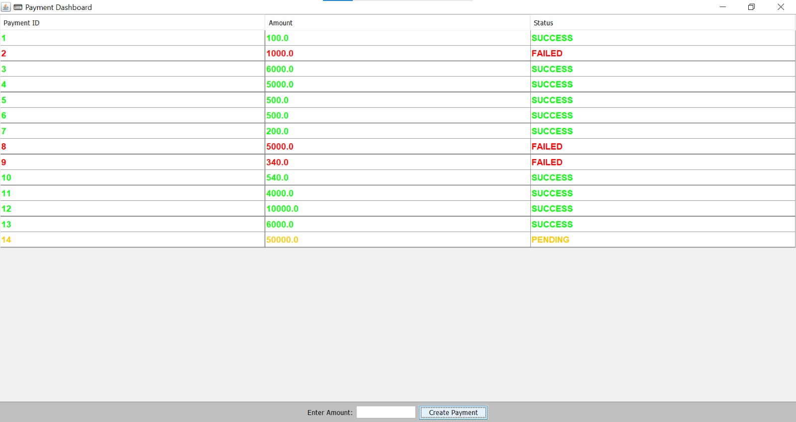
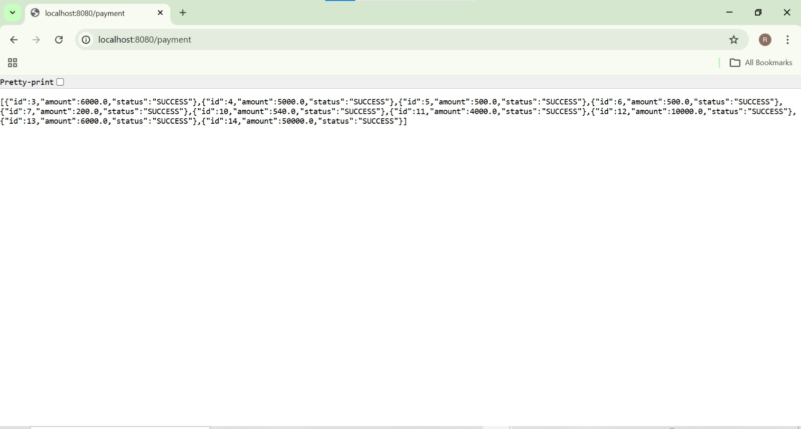

💳 Event-Driven Payment System

🚀 Overview

* This project is a simple event-driven payment system built using Java.
* I created a desktop application using Java Swing which sends payment requests to a backend server developed using Spring Boot.
* The system shows how frontend and backend communicate using REST APIs.

---

🧱 Architecture

Java Swing UI → HTTP Request → Spring Boot Backend → Response

---

💻 Tech Stack

- Java (Swing for frontend UI)
- Spring Boot (backend)
- REST API (HTTP + JSON)

---

✨ Features

- Create payment from UI
- Shows payment status (PENDING → SUCCESS)
- Random failure simulation (FAILED cases)
- Auto refresh every 2 seconds
- Multiple payments tracking
- Color indication for status:
  - SUCCESS → Green
  - FAILED → Red
  - PENDING → Orange

---

📸 Screenshots

### UI Dashboard

### API Response

---

🎥 Demo Video

---

⚙️ How to Run

Backend

Go to payment-system folder and run:
.\mvnw.cmd spring-boot:run

---

Frontend

Run Dashboard.java file

---

🎯 What I Learned

- How frontend and backend communicate using APIs
- Basics of event-driven systems
- Handling real-time updates using polling
- Building UI using Java Swing

---

👩‍💻 Author

Swetha
